# Trading Algorithm Evaluation

## Baseline Performance

### Initial Setup

1. Imported OHLCV dataset into a Pandas DataFrame.
2. Generated trading signals using short- and long-window SMA values.
3. Split the data into training and testing datasets.
4. Utilized the SVC classifier model to fit the training data and make predictions.
5. Reviewed the classification report associated with the SVC model predictions.

### Baseline Evaluation
The baseline model using SVC classifier resulted in:

* Accuracy Score - 55%
* Precision for Buying Stock - 56%
* Recall for Buying Stock - 96% 
* Precision for Selling Stock - 43%
* Recall for Selling Stock - 4% 
 
 

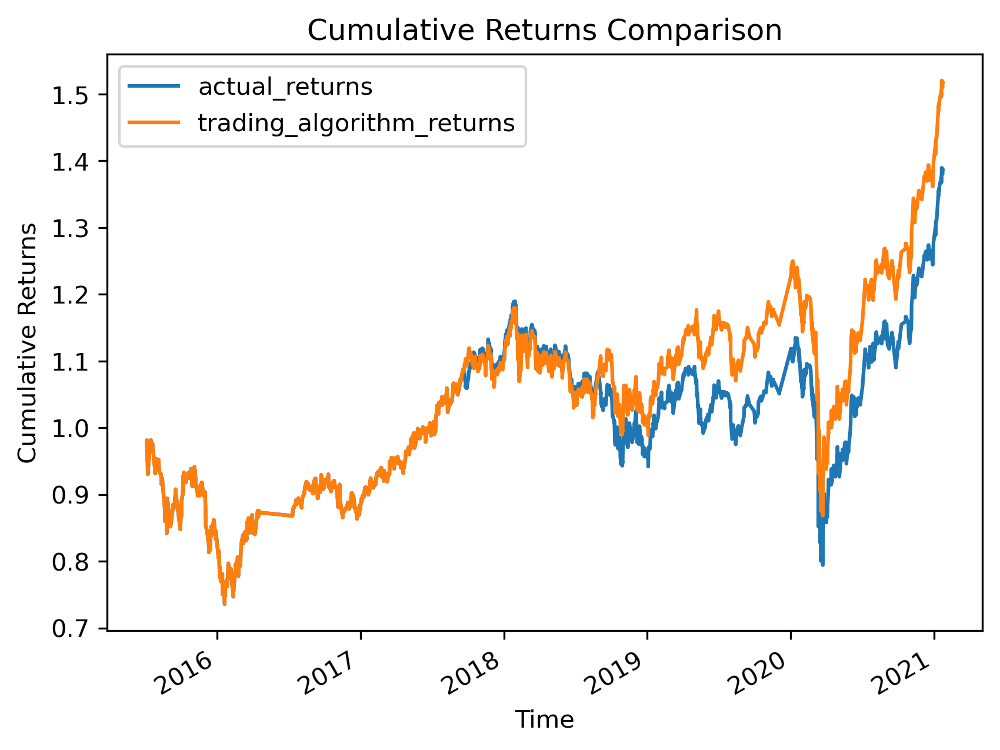

## Tuning the Baseline Trading Algorithm

### Parameter Tuning
1. **Varying Training Data Size:**

   - Decreased training data - Reduction of offset to 2 months:
      - Accuracy Score - 55%
      - No significant change in precision or recall in buying or selling stocks.
      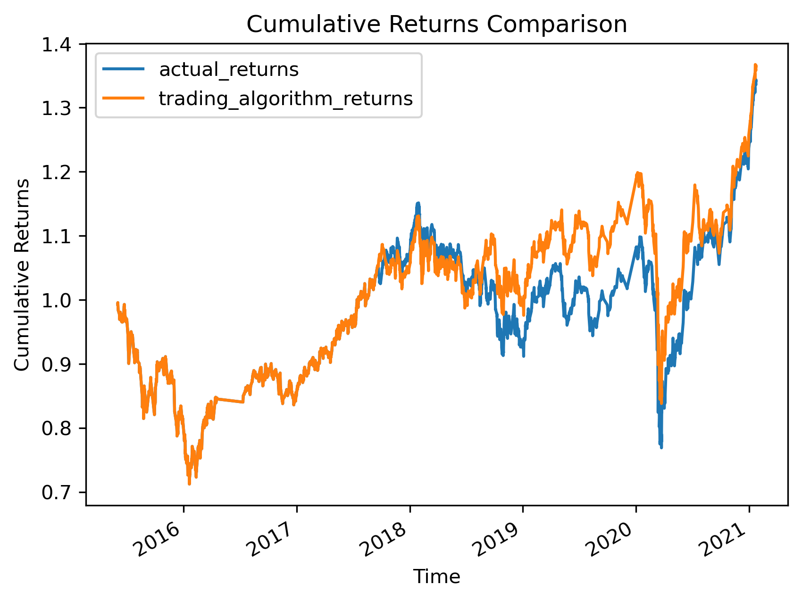

   - Increased training data - Increase of the offset to 6 months:
      - Accuracy Score - 56% | slight increase 
      - No significant change in precision or recall in buying or selling stocks.
      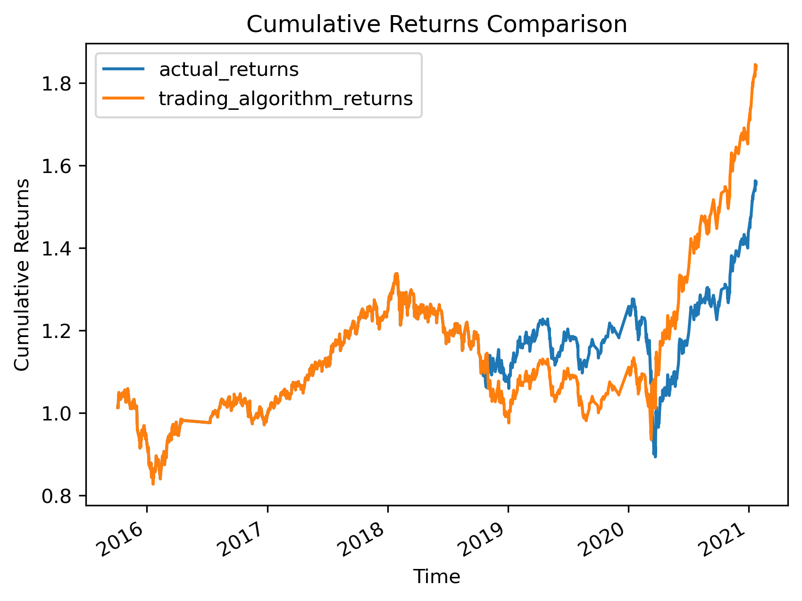
    
    - Increased training data - Increase of the offset to 12 months:
      - Accuracy Score - 55% 
      - Precision and Recall score for selling stocks are undefined implying that there are no predicted samples for the particular class label.
      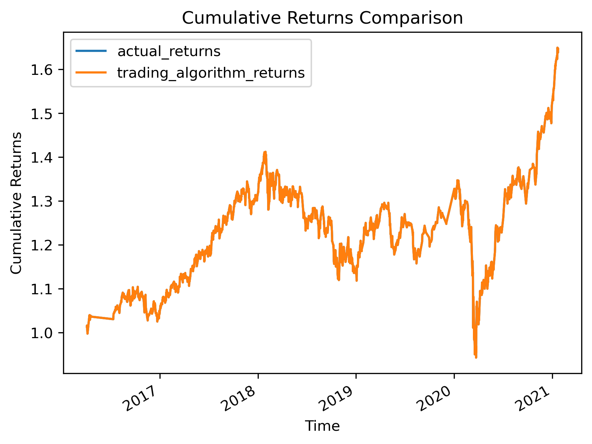

2. **Adjusting SMA Windows:**
   - Decreasing the short-window SMA:
      - Accuracy Score - 56% | slight increase
      - No significant change in precision or recall in buying or selling stocks.
      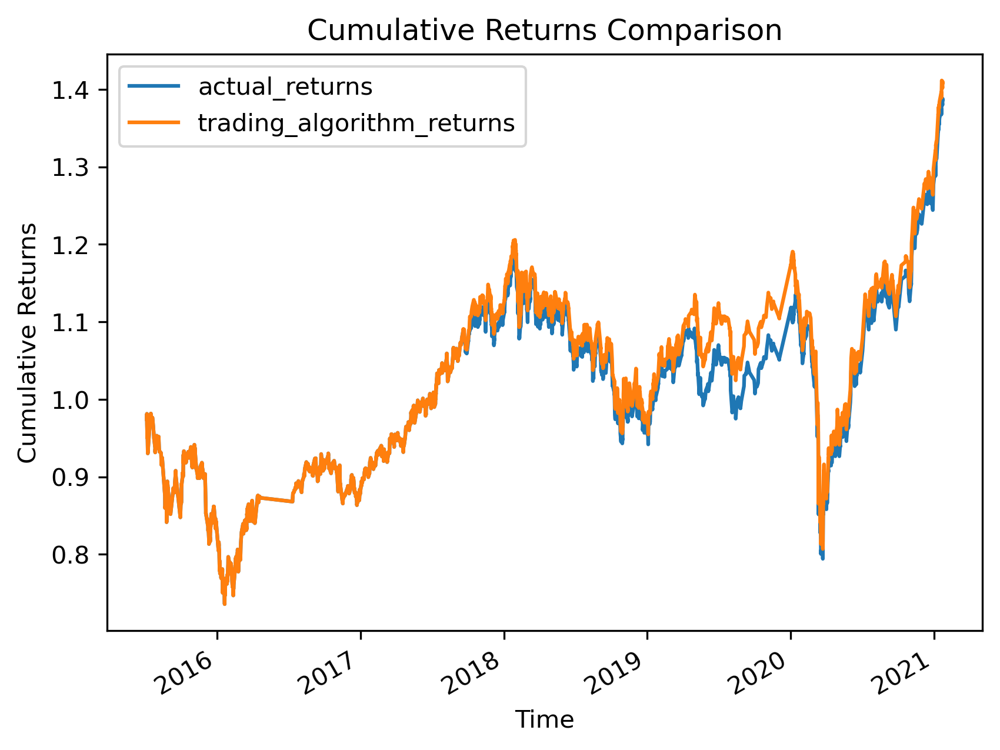

   - Increasing the short-window SMA:
      - Accuracy Score - 56% | slight increase
      - Recall for selling stocks is 0%
      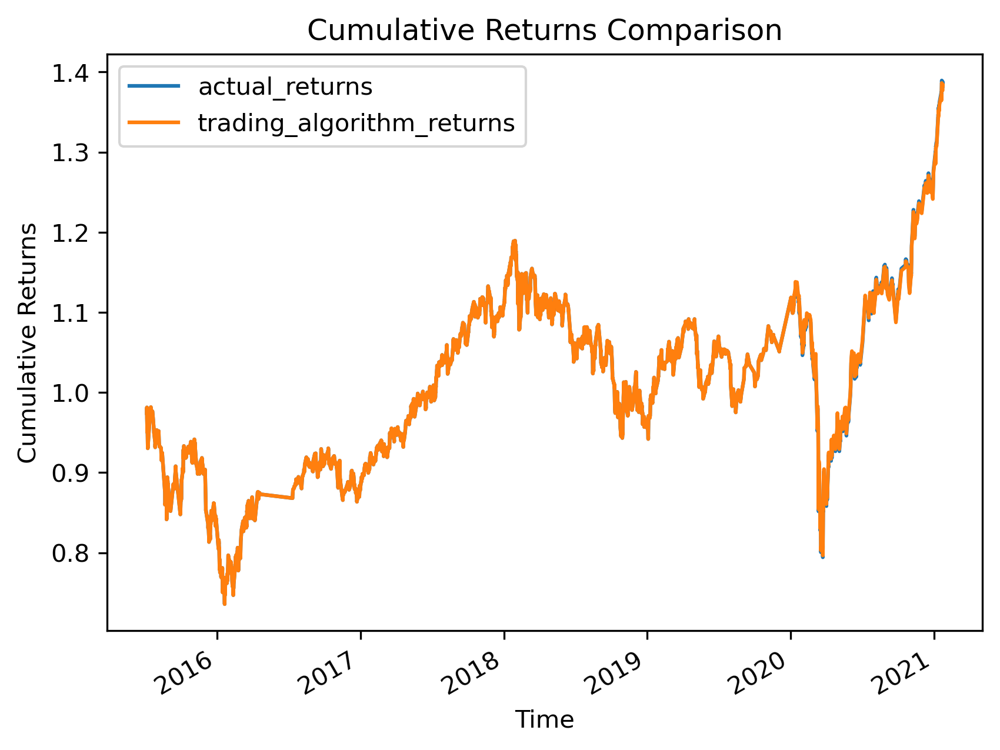 

   - Decreasing the long-window SMA:
      - Accuracy Score - 54% | slight decrease 
      - Recall improved slightly to 7%
      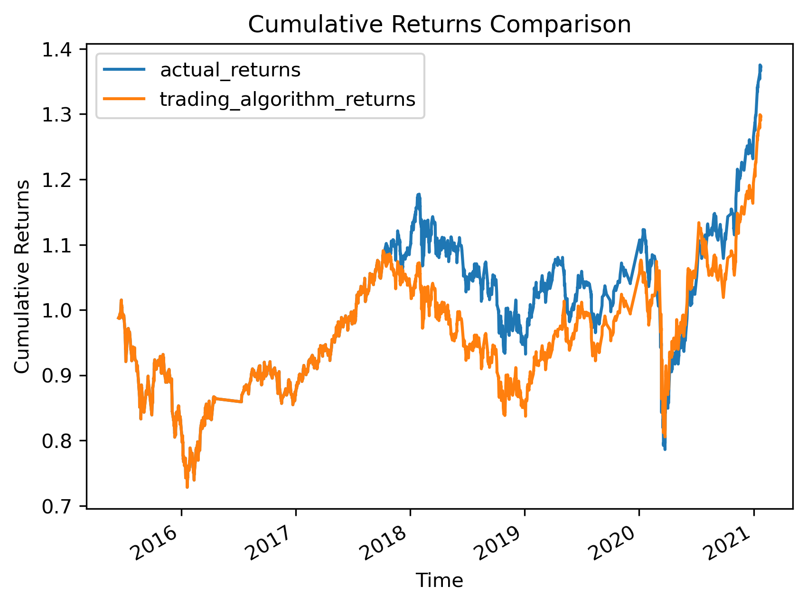
      
   - Increasing the long-window SMA to 150:
      - Accuracy Score - 56% | slight increase
      - No significant change in precision or recall in buying or selling stocks.
      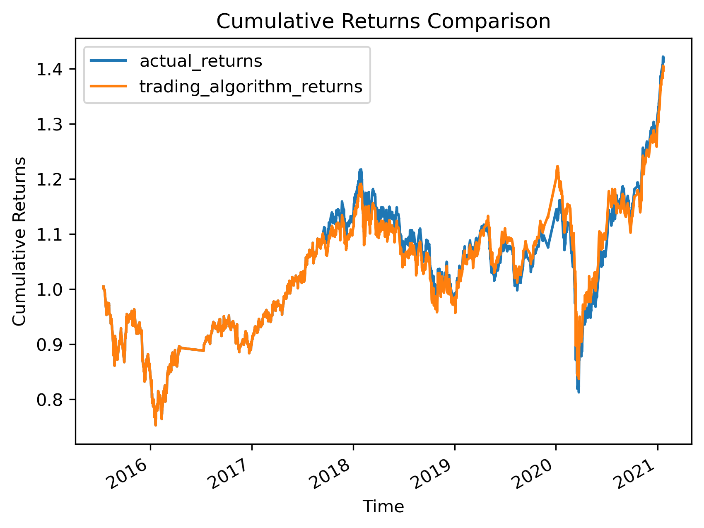 

3. **Mixed Cases:**
   - Decreasing the short-window SMA & Increased training data
      - Setting short-window to 2 and training data offset to 6 months.
      - Accuracy Score - 56% | slight increase
      - No significant change in precision or recall in buying or selling stocks.
      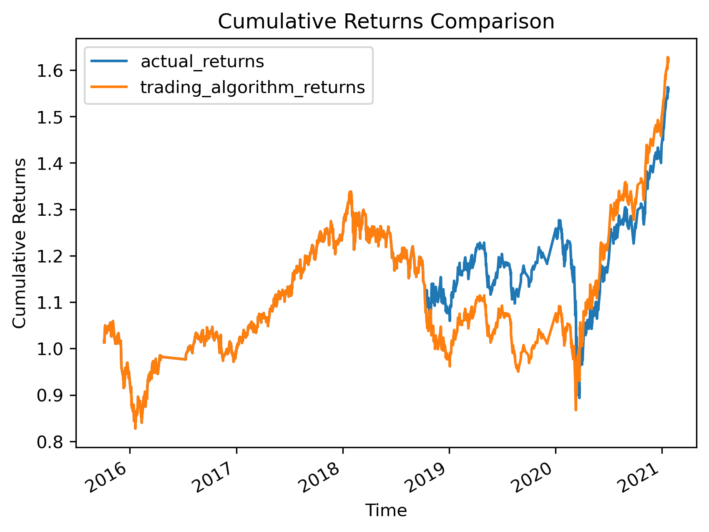 

   - Decreasing the short-window SMA, increasing the long-window SMA & Increased training data
      - Setting short-window to 2, long-window to 120 and training data offset to 6 months.
      - Accuracy Score - 56% | slight increase
      - No significant change in precision or recall in buying or selling stocks.
      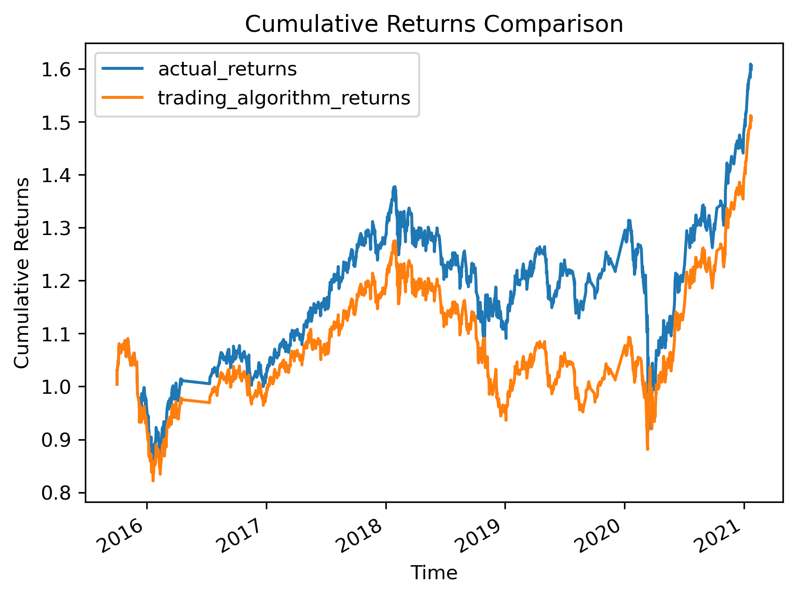 

### Conclusion
None of the tuning resulted in results with significant changes. Using a larger training data resulted in no predicted labels. Reduction in the short window indicated a minor improvement. 

## Evaluate a New Machine Learning Classifier

### Alternate Model - Logistic Regression
The logisitic regression model resulted in:

* Accuracy Score - 52%
* Precision for Buying Stock - 56%
* Recall for Buying Stock - 66% 
* Precision for Selling Stock - 44%
* Recall for Selling Stock - 33% 
 
 

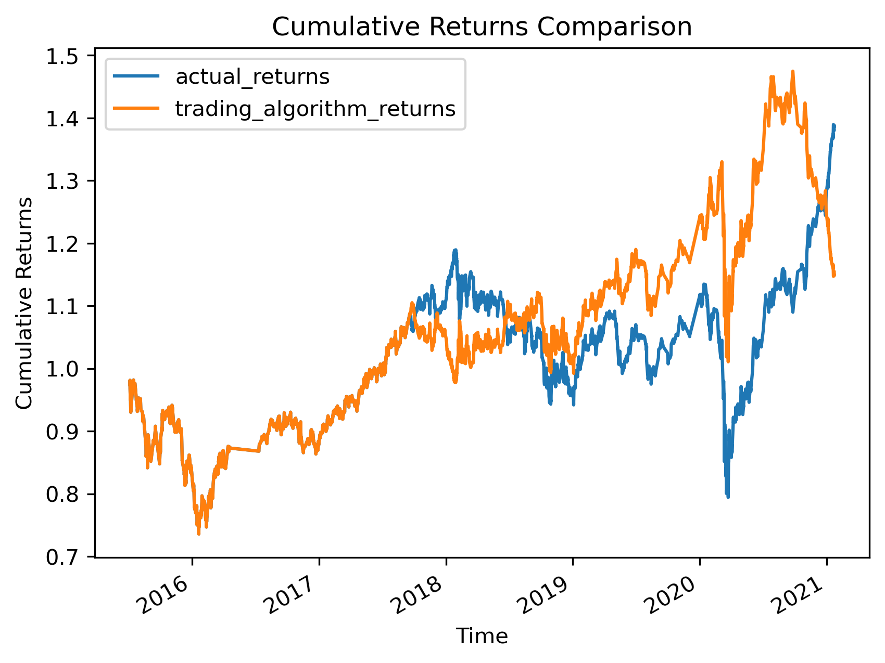

The model yielded a lower accuracy score of 52% compared to the baseline's 55% implying that the logistic regression performed slightly worse than the baseline SVC model in terms of accuracy and trading returns. However, it did have a good recall rate in selling stock.

## Summary Evaluation Report

Considering the parameter tuning experiments and alternate model evaluations, it's evident that fine-tuning specific parameters can significantly impact the trading algorithm's performance. Further exploration might involve experimenting with additional models or incorporating more sophisticated features to enhance predictive capabilities.
